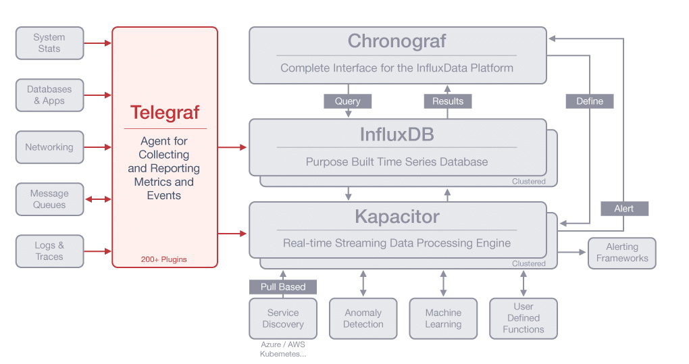

Telegraf是一个用Golang写的开源数据收集Agent，基于插件驱动。本身提供的输入和输出插件非常丰富，当然有需求也可以自行编写（需要重新编译）。Telegraf是influxdata公司的时间序列平台TICK技术栈中的“T”，主要用于收集时间序列型数据，比如服务器CPU指标、内存指标、各种IoT设备产生的数据等等。后面抽空会介绍TICK栈中的其他技术及其应用。



### 1. 核心概念

Telegraf工作原理大概是这样：定时去执行输入插件收集数据，数据经过处理插件和聚合插件，批量输出到数据存储。

**1> 数据指标（Metrics）**

- 指标名（Measurement name）：指标描述和命名。
- 标签集合（Tags）：Key/Value键值对，可以类比为关系型数据库的键值，常用于快速索引和唯一标识。标签在设计的时候，尽量避免各种数值型，尽量使用有限集合。
- 字段集合（Fields）：Key/Value键值对，包含指标描述的数据类型和值。
- 时间戳（Timestamp）：此条指标数据的时间戳。

**2> 插件（Plugins）**

Telegraf有四种类型的插件：

- 输入插件（Inputs）：收集各种时间序列性指标，包含各种系统信息和应用信息的插件。
- 处理插件（Process）：当收集到的指标数据流要进行一些简单处理时，比如给所有指标添加、删除、修改一个Tag。只是针对当前的指标数据进行。
- 聚合插件（Aggregate）：聚合插件有别于处理插件，就在于它要处理的对象是某段时间流经该插件的所有数据（所以，每个聚合插件都有一个`period`设置，只会处理`now()-period`时间段内的数据），比如取最大值、最小值、平均值等操作。
- 输出插件（Outputs）：收集到的数据，经过处理和聚合后，输出到数据存储系统，可以是各种地方，如：文件、InfluxDB、各种消息队列服务等等。


一般在使用的时候，关注Inputs和Outputs会比较多。

### 2. 简单用法

**快速生成配置并启动**

```bash
# 生成配置
telegraf config -input-filter cpu:mem -output-filter influxdb > telegraf.conf

# 运行Telegraf
telegraf --config telegraf.conf
```

**查看输出**

```bash
# 修改配置
[[outputs.influxdb]]
  urls = ["udp://localhost:8089"]

# 使用`netcat`监听8080端口
nc -lu 8089
```

**输入测试**

```bash
# 修改配置
[[inputs.socket_listener]]
   service_address = "tcp://:8094"
   data_format = "influx"

# 输入测试
echo 'mymeasurement,my_tag_key=mytagvalue my_field="my field value"' | nc localhost 8094
```

### 3. 常用插件

Telegraf所有插件都对应配置中的一段，下面快速了解一下常用的几个插件，详情查看Github主页，介绍的非常全面，用到时再详情了解也不迟。

**常用输入插件**

- `cpu` ：系统CPU信息，如用户态和系统态利用率等等。
  
```bash
[[inputs.cpu]]
  ## 是否收集每个CPU核心
  percpu = true
  ## 是否收集所有核心的组合值
  totalcpu = true
  ## ...
```
- `mem` ：系统内存信息，如物理、虚拟、交换内存量等等。
- `disk` ：磁盘占用信息。
- `diskio` ：磁盘IO性能。
- `net`和`netstat` ：网卡和网络信息。
- `system` ：当前系统负载信息，类似`uptime`信息。
- `file` ：每个时间周期读取文件所有信息。
  
```bash
[[inputs.file]]
  ## 支持文件通配符
  ##   /var/log/**.log     -> recursively find all .log files in /var/log
  ##   /var/log/*/*.log    -> find all .log files with a parent dir in /var/log
  ##   /var/log/apache.log -> only read the apache log file
  files = ["/var/log/apache/access.log"]
  data_format = "influx"
```

- `procstat` ：收集满足条件的进程信息，包含进程CPU占用、内存占用等信息。
  
```bash
[[inputs.procstat]]
  ## 根据PID文件收集
  pid_file = "/var/run/nginx.pid"
  ## 根据可执行文件名 (ie, pgrep <exe>)
  # exe = "nginx"
  ## 根据可执行文件名模式匹配 (ie, pgrep -f <pattern>)
  # pattern = "nginx"
```
- `exec`　：定时执行某个可执行文件，可执行文件根据要求输出到标准输出即可。
  
```bash
## 配置
[[inputs.exec]]
  ## Commands array
  commands = [
    "/tmp/test.sh",
    "/usr/bin/mycollector --foo=bar",
    "/tmp/collect_*.sh"
  ]
  data_format = "influx"

## test.sh示例
#!/bin/sh
echo 'example,tag1=a,tag2=b i=42i,j=43i,k=44i'

```

- `influxdb_listener`或`http_listener_v2` ：外部应用可以通过HTTP请求把数据发送给Telegraf。
```bash

## 配置
[[inputs.influxdb_listener]]
  ## Address and port to host HTTP listener on
  service_address = ":8186"

### 写入
curl -i -XPOST 'http://localhost:8186/write' --data-binary 'cpu_load_short,host=server01,region=us-west value=0.64 1434055562000000000'
```

**常用输出插件**

- `influxdb`　：输出到InfluxDB。
```bash
# Configuration for sending metrics to InfluxDB
[[outputs.influxdb]]
  ## influxdb数据库信息
  # urls = ["unix:///var/run/influxdb.sock"]
  # urls = ["udp://127.0.0.1:8089"]
  urls = ["http://127.0.0.1:8086"]

  ## influxdb数据库名
  database = "telegraf"

  ## inflxudb用户名和密码
  # username = "telegraf"
  # password = "password"
```

- `file`　：输出到文件。
```bash
[[outputs.file]]
  ## Files to write to, "stdout" is a specially handled file.
  files = ["stdout", "/tmp/metrics.out"]
  data_format = "influx"
```

- `http` ：输出到某个HTTP服务器。
```bash
# A plugin that can transmit metrics over HTTP
[[outputs.http]]
  ## URL is the address to send metrics to
  url = "http://127.0.0.1:8080/metric"
  data_format = "json"
```  

### 4. 常见需求

1> 同种类型的输入和输出插件可以配置多个吗？

> 可以支持！比如：可以根据命名规则把不同的指标，写到不同influxdb里面。

2> 所有指标都打一个相同的指标怎么做？

> 方法一：telegraf.conf里面`[global_tags]`段里面直接配置。
>
> 方法二：telegraf.conf里面`[global_tags]`段里面配置环境变量。此方法意义非常大，这样运维同学在部署好环境的时候，设置好环境变量，telegraf.conf保持一份即可。
> 
> 方法三：使用process插件

3> 自己怎么写插件？

> 有需求，先看官方提供的插件是否能满足需求，实在不行就自行开发，也很简单。说来话长，改日再聊。自行编译通过先：

``` bash
## 安装 Go >=1.9 (1.10 recommended)
## 安装 dep ==v0.5.0　（国内同学准备吐血吧！要么挂vpn，要么手动一个个从github往下扒）
## 下载 Telegraf 源码:
go get -d github.com/influxdata/telegraf
## 尝试编译
cd "$HOME/go/src/github.com/influxdata/telegraf"
make
###
```

### 5. 参考资料

- https://docs.influxdata.com/telegraf
- https://github.com/influxdata/telegraf